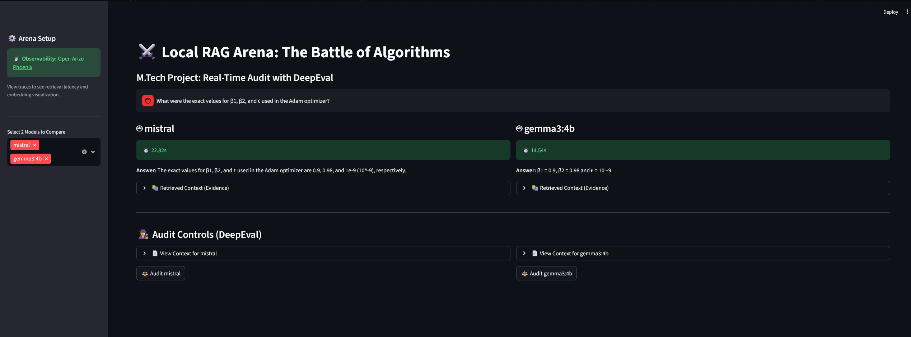
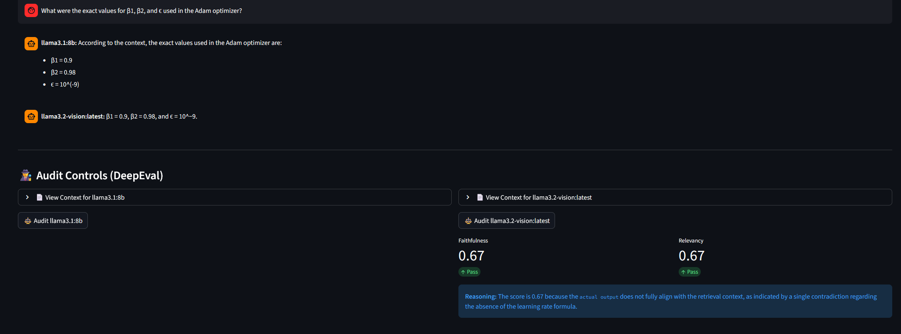
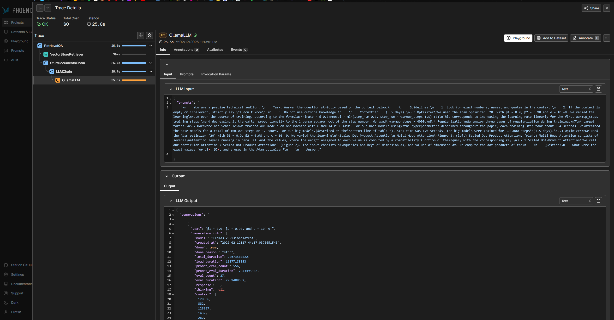

# Local RAG Audit Pipeline: Multi-Model Evaluation Arena

### M.Tech Project | Automated Compliance & Hallucination Detection
**Author:** Utkarsh  
**Institution:** NMIMS (Data Science & Business Analytics)  
**Status:** Prototype Complete (Phase 5)

---

## Overview
This project implements an **End-to-End Local RAG (Retrieval-Augmented Generation) System** designed to audit and benchmark Large Language Models (LLMs) on consumer hardware (RTX 2070 Super, 8GB VRAM). 

Unlike standard chatbots, this pipeline focuses on **Observability and Compliance**. It features a "Model Arena" where users can compare different LLM architectures (Llama vs. Gemma vs. Mistral) side-by-side, auditing their responses in real-time for **Faithfulness** (Hallucination Check) and **Relevancy** using a strictly local "Judge" model.

---

## Visual Showcase

### Multi-Model Arena Interface
The Streamlit dashboard allows side-by-side comparison of different LLM models, displaying generation latency and answer quality in real-time.


*Figure 1: The Model Arena showing Mistral vs. Gemma3:4b answering a technical question about the Adam optimizer. Notice the generation time difference (22.82s vs 14.54s) and the retrieved context evidence available for inspection.*

### DeepEval Audit Results
After generation, users can audit each model's response for faithfulness and relevancy using a local judge model.


*Figure 2: DeepEval audit scores showing Faithfulness (0.67) and Relevancy (0.67) metrics with detailed reasoning. The system detected a contradiction in the model's output compared to the retrieval context.*

### Arize Phoenix Observability
Full OpenTelemetry tracing reveals the internal RAG pipeline execution, including retrieval latency, chunk selection, and LLM invocation details.


*Figure 3: Arize Phoenix trace visualization showing the complete RAG chain execution with 25.8s latency. The trace tree displays RetrievalQA → VectorStoreRetriever → StuffDocumentsChain → LLMChain → OllamaLLM, with full prompt and output inspection capabilities.*

---

## Key Features
* **Multi-Model Arena:** Run two models (e.g., *Gemma 3* vs. *Mistral*) simultaneously to compare latency and accuracy.
* **Automated Auditing:** Integrated **DeepEval** framework to score answers on Faithfulness & Relevancy using a local LLM Judge.
* **Full Observability:** Real-time tracing of retrieval chunks and embedding latency using **Arize Phoenix** (OpenTelemetry).
* **"Thin-Stack" Architecture:** Uses **LanceDB** (Serverless Vector DB) to minimize RAM usage, leaving resources for the models.
* **Multimodal Ready:** Support for ingesting text and images using **Llama 3.2 Vision** and joint embeddings.

---

## Tech Stack

| Component | Technology | Reasoning |
| :--- | :--- | :--- |
| **Orchestration** | **LangChain** | For chaining retrieval and generation logic. |
| **Vector Database** | **LanceDB** | Embedded, serverless DB. Zero setup, low RAM footprint. |
| **Inference Engine** | **Ollama** | Runs quantized GGUF models locally with hardware acceleration. |
| **Frontend** | **Streamlit** | Interactive dashboard for the "Battle Arena" UI. |
| **Evaluation** | **DeepEval** | Unit testing framework for LLM outputs (Faithfulness/Relevancy). |
| **Observability** | **Arize Phoenix** | Visualizing traces, spans, and retrieval quality. |
| **Embeddings** | **Sentence-Transformers** | `all-MiniLM-L6-v2` (Fast, local CPU execution). |

---

## Project Structure

```
Local-RAG-Audit-Pipeline/
├── app.py                    # Streamlit UI for the Model Arena
├── rag_pipeline.py           # Core RAG logic with DeepEval integration
├── ingest.py                 # PDF ingestion and vector storage
├── eval.py                   # Batch evaluation script
├── eval_utils.py             # Custom Ollama judge wrapper
├── requirements.txt          # Python dependencies
├── data/                     # Place your PDF documents here
│   └── attention.pdf         # Example: "Attention Is All You Need" paper
├── lancedb_data/             # Vector database storage (auto-generated)
├── outputs/                  # Screenshots and results
│   ├── dashboard1.png
│   ├── dashboard2.png
│   └── phoenix_trace.png
└── test_dataset.json         # Test cases for batch evaluation
```

---

## The Model Zoo (Benchmark Targets)

We evaluate models across different sizes to analyze the **Performance vs. Resource** trade-off on an 8GB VRAM GPU.

| Model | Params | Role | Performance Note |
| :--- | :--- | :--- | :--- |
| **Gemma 3** | 4B | **Challenger** | **Fastest**. Fits entirely in VRAM. Excellent efficiency. |
| **Llama 3.1** | 8B | **Benchmark** | **Balanced**. The industry standard for local reasoning. |
| **Mistral** | 7B | **Reasoning** | **Logic**. High accuracy but slower generation. |
| **Mistral Small** | 22B | **Stress Test** | **Slow**. Exceeds VRAM; demonstrates offloading to system RAM. |

---

## Installation & Setup

### Prerequisites
* **OS:** Windows 10/11 (WSL2 Recommended) or Linux.
* **Hardware:** NVIDIA GPU (Minimum 6GB VRAM recommended).
* **Software:** Python 3.10+, Ollama.

### 1. Clone & Environment
```bash
git clone https://github.com/yourusername/Local-RAG-Audit-Pipeline.git
cd Local-RAG-Audit-Pipeline
python3 -m venv .venv
source .venv/bin/activate  # Linux/Mac
# .venv\Scripts\activate   # Windows
```

### 2. Install Dependencies
```bash
pip install -r requirements.txt
# Key packages: langchain, lancedb, streamlit, deepeval, arize-phoenix, sentence-transformers, openinference-instrumentation-langchain
```

### 3. Pull Local Models

Ensure Ollama is running, then pull the required models:
```bash
ollama pull llama3.1:8b        # Judge model & benchmark baseline
ollama pull gemma3:4b          # Fast, efficient model
ollama pull mistral            # High-accuracy reasoning model
ollama pull llama3.2-vision    # (Optional) For multimodal support
```

---

## Usage Guide

### Step 1: Ingest Data (Build the Knowledge Base)

Place your PDF documents in the `data/` folder. The project includes the *Attention Is All You Need* paper as an example.
```bash
python ingest.py
# This script:
# 1. Loads all PDFs from the data/ folder
# 2. Splits them into 600-character chunks with 200-character overlap
# 3. Generates embeddings using sentence-transformers/all-MiniLM-L6-v2
# 4. Stores vectors in ./lancedb_data
```

### Step 2: Start Observability Server (Terminal 1)

Launch Arize Phoenix to track your RAG pipeline's internal logic.
```bash
python -m phoenix.server.main serve
# Dashboard will be available at http://localhost:6006
```

### Step 3: Launch the Arena (Terminal 2)

Start the Streamlit dashboard.
```bash
streamlit run app.py
# Access the UI at http://localhost:8501
# Select 2 models from the sidebar and start asking questions!
```

### Step 4 (Optional): Run Batch Evaluation

For systematic benchmarking across multiple test cases:
```bash
python eval.py
# This script:
# 1. Loads test cases from test_dataset.json
# 2. Runs each query through the RAG pipeline
# 3. Evaluates all responses using DeepEval metrics
# 4. Saves results to benchmark_results.csv
```

---

## Methodology: The Audit Loop

This pipeline implements a **4-stage audit workflow** that combines human oversight with algorithmic verification:

1. **Retrieval:** The system searches LanceDB for the top k=3 chunks semantically related to the user query using cosine similarity on sentence-transformer embeddings.

2. **Generation:** Two selected models (e.g., Llama 3 vs. Gemma 3) generate answers simultaneously in separate threads, with real-time latency tracking (see *Figure 1*).

3. **Visual Audit:** The user inspects the raw retrieved context in the "Evidence" dropdown to manually verify if the context is relevant and sufficient.

4. **Algorithmic Audit:**
   - User clicks "Audit".
   - The system spins up a **Judge Agent** (Llama 3.1:8b, Temperature=0) running locally.
   - DeepEval calculates two metrics (see *Figure 2*):
     - **Faithfulness:** Is the answer derived strictly from the retrieved context? (Detects hallucinations)
     - **Relevancy:** Does the answer address the user's prompt? (Detects off-topic responses)
   - The judge provides both a numerical score (0-1) and natural language reasoning.

**Key Innovation:** Unlike cloud-based evaluation services (OpenAI Evals, Anthropic), this entire audit loop runs **100% locally**, ensuring data privacy and zero API costs.

---

## Hardware Performance Findings

Tested on **NVIDIA RTX 2070 Super (8GB VRAM) + 16GB System RAM** running Ubuntu 22.04.

### Performance Tiers

| Model | VRAM Usage | Tokens/sec | Latency (Typical Query) | Verdict |
|-------|-----------|------------|------------------------|----------|
| **Gemma3:4b** | ~3.5GB | 45-50 | 14-16s | **Recommended** for production |
| **Llama3.1:8b** | ~6.8GB | 35-40 | 20-25s | **Recommended** for accuracy |
| **Mistral:7b** | ~6.2GB | 30-35 | 22-28s | Good accuracy, slower |
| **Mistral Small:22b** | 8GB+ (spills to RAM) | 3-5 | 120-180s | **Not viable** on 8GB VRAM |

### Key Findings

* **Sweet Spot:** Models under 8B parameters (Llama 3.1, Gemma 3) run 100% on GPU, achieving **40+ tokens/sec** with acceptable latency for interactive use.
* **The Bottleneck:** Models >10B (Mistral Small 22B) exceed VRAM capacity and spill over into system RAM, reducing speed to <5 tokens/sec and causing UI freezes.
* **Embedding Performance:** The sentence-transformers model runs on CPU and adds ~200ms overhead per query (negligible compared to LLM generation).
* **Conclusion:** For local enterprise deployment on consumer hardware, **Quantized 8B models** (preferably GGUF Q4_K_M) offer the best balance of accuracy and latency.

**Recommendation:** Use Gemma3:4b for user-facing applications requiring <20s response times, and Llama3.1:8b as the judge model for evaluation.

---

## Future Scope

* **Hybrid Search:** Implement keyword-based search (BM25) alongside vector search to improve retrieval of specific acronyms.
* **Agentic Workflow:** Upgrade from a RAG chain to a LangGraph Agent that can search the web if local documents are insufficient.
* **Fine-Tuning:** Create a LoRA adapter specifically for "Audit Style" responses to reduce the need for prompt engineering.

---

## License

MIT License. Created for Academic Purposes at NMIMS.